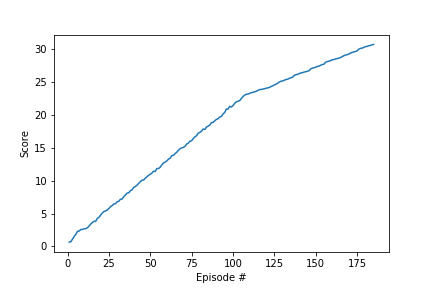

# Report 

### Learning Algorithm

For this Project I used the a Deep Deterministic Policy Gradient (e.g. DDPG) which is well suited for reinforcement learning problems in continuous spaces. DDPG is an pseudo-actor critic model that differs from your standard actor critic model in that the critic is used to approximate the maximizer over the Q values for the next state instead of a learned baseline. The actor approximates the optimal policy deterministically, which is then maximized by the critic. For network arctitecture, a simple target network was used to prevent the model from chasing "moving target" values, and an experience replay that was sampled randomly to further learn from previous action state combinations very similarly to the DQN algorithm used in the banana navigation project. The neural networks themselves were rudimentary at best, they are 3 layer fully connected linear layers using rectified linear unit activation functions and batch normalization on the first layer of the network to minimize internal covariate shift. For hyperparameters I used the following:

| Name                     |  value                   |
:-------------------------:|:-------------------------:
 Buffer Size               |  1e6
 Batch Size                | 128
 Initial Epsilon           | 1.0
 Minimum Epsilon           | 0.2
 Epsilon Decay             | 1e-6
 max number of episodes    | 2000, actual: ~180
 max timesteps per episode | 1000
 Tau                       | 1e-3
 Gamma                     | 0.95
 actor learning rate       | 1e-4
 critic learning rate      | 1e-3
 network update rate       | every 20 episodes
 number of network updates | 10 updates

###  Plot of Rewards

This graph does a great job of illustrating the oscillations I mentioned above and why training the vanilla DQN was so computationally expensive. 

### Ideas for future work

I have a few interests as far as future work goes. First, I would like to try adding adaptive noise to the parameter space as opposed to the action space, I've  that **make smarter** using parameter space noise as opposed to action space noise imporoves model performance and action space exploration. By injecting randomness directly into the parameters of the agent it alters the types of decisions it makes such that they always fully depend on what the agent currently senses. Since this method adds noise to the parameters of the policy, it makes an agent’s exploration consistent across different timesteps, whereas adding noise to the action space leads to more unpredictable exploration which isn’t correlated to anything unique to the agent’s parameters. The second future work I would like to go regarding this problem space is exporing the possibilities of using evolutionary strategies for solving the same problems. This interests me due to the compute resources required to train the reinforcement algorithms, as well as the fact that they are not easily scalable. [This open AI article](https://openai.com/blog/evolution-strategies/) proclaims to have cut down training time of policy based deep RL algorithms by 2 orders of magnitued by using evolutionary strategies and scaling up their computing resources. These evolutionary strategies tout the following No need for backprop, high parallelizability, a smaller set of hyperparameters to optimize, and "structured exploitation".
